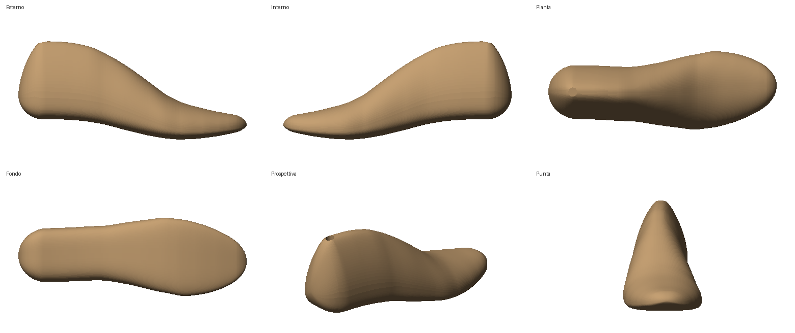

# Forma 3D da montaggio – uomo

Forma (last) parametrica per calzatura uomo, generata in Python ed esportata in STL.



## File

| File | Contenuto |
|---|---|
| `output/forma_uomo_42_tacco25_dx.stl` | forma destra, tg 42, tacco 25 mm |
| `output/forma_uomo_42_tacco25_sx.stl` | forma sinistra (speculare) |
| `output/forma_uomo_42_tacco25_misure.json` | misure ricavate dalla mesh |
| `genera_forma.py` | generatore parametrico |
| `anteprima.py` | rendering PNG delle 6 viste |

## Caratteristiche (tg 42, punto Paris)

- Lunghezza 280 mm · larghezza pianta 94 mm · larghezza tallone 66,4 mm
- Giro pianta ≈ 252 mm · giro collo ≈ 240 mm · altezza 121 mm
- Tacco 25 mm, slancio punta 12 mm, punta tonda leggermente spostata all'interno
- Foro bussola Ø 11 × 45 mm sul cono per il perno della macchina da montaggio
- Mesh chiusa (watertight), unità in mm; X = tallone→punta, Y = interno, Z = alto

## Rigenerare / altre taglie

```bash
pip install -r requirements.txt
python3 genera_forma.py --taglia 43 --tacco 30   # --senza-foro per forma piena
python3 anteprima.py output/forma_uomo_43_tacco30_dx.stl anteprima.png
```

Sviluppo taglie: lunghezza a punto Paris (6,67 mm), giro +5 mm/numero.
Il cambio tacco ruota il retropiede attorno alla battuta (approssimazione:
per variazioni grandi va ricontrollata la curva del fondo).

I profili (fondo, dorso, larghezze, centro, chiusure tallone/punta) sono
tabelle in testa a `genera_forma.py`: modificandole si cambia lo stile della forma.
