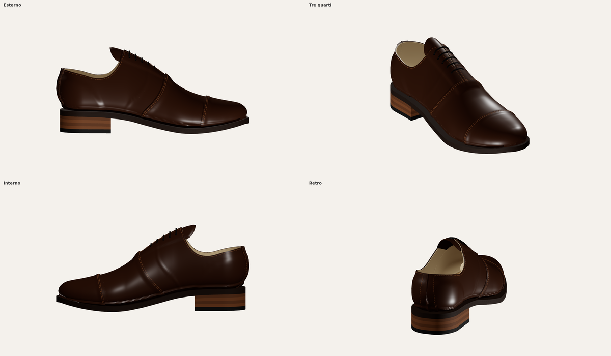
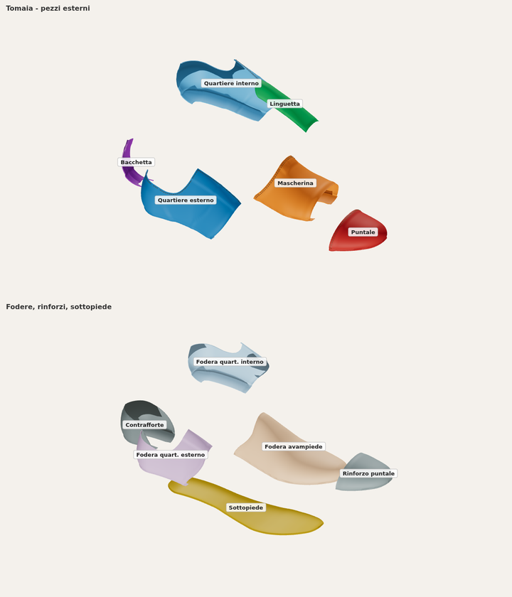
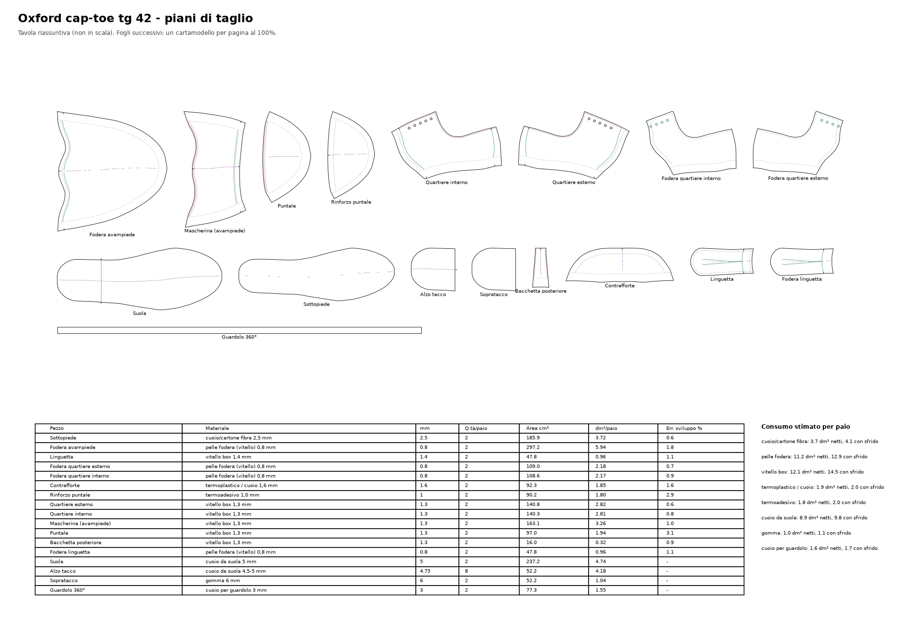

# Oxford uomo cap-toe – modello 3D

Oxford classica (allacciatura chiusa, puntale riportato, 5 occhielli) costruita
sulla forma `forma_3d` (tg 42, tacco 25 mm). Ogni pezzo della tomaia è ritagliato
sulla superficie della forma lungo le linee di modello, così da poterlo poi
sviluppare in piano per i piani di taglio.




## Pezzi (per scarpa destra; quantità per paio = 2)

| Pezzo | Materiale | Spess. | Area su forma | Bordi |
|---|---|---|---|---|
| Puntale | vitello box | 1,3 | 65 cm² | linea puntale (a vista, doppia cucitura), filo forma |
| Mascherina | vitello box | 1,3 | 128 cm² | gola + cucitura sui quartieri (a vista, doppia), riporto 10 mm sotto il puntale, filo forma |
| Quartiere esterno / interno | vitello box | 1,3 | 118 cm² | bocca, occhielleria, cucitura posteriore, riporto 12 mm sotto la mascherina, filo forma |
| Bacchetta posteriore | vitello box | 1,3 | 12 cm² | bordi a vista, bocca, filo forma |
| Linguetta | vitello box | 1,4 | 49 cm² | bordo libero, attacco 14 mm sotto la mascherina |
| Fodera avampiede | vitello fodera | 0,8 | 234 cm² | riporto 8 mm sotto le fodere quartiere, filo forma |
| Fodera quartiere esterno / interno | vitello fodera | 0,8 | 88 cm² | bocca, occhielleria, cucitura posteriore, cucitura fodere (20 mm dietro la mascherina) |
| Contrafforte | termoplastico/cuoio | 1,6 | 67 cm² | bordo scarnito, filo forma |
| Rinforzo puntale | termoadesivo | 1,0 | 71 cm² | bordo scarnito (4 mm oltre la linea puntale), filo forma |
| Sottopiede | cuoio/fibra | 2,5 | 187 cm² | contorno del fondo forma |

Fondo: guardolo 360° (cuoio 3 mm), suola cuoio 5 mm (contorno a 4–6,5 mm dalla forma),
tacco 25 mm in 4 alzi più sopratacco in gomma 6 mm, petto tacco a 76 mm.

Ordine degli strati dalla forma verso l'esterno: sottopiede → fodera avampiede →
linguetta → fodere quartiere → contrafforte / rinforzo puntale → quartieri →
mascherina → puntale / bacchetta. I bordi di riporto sono scarniti nel 3D.

## Linee di modello principali (tg 42)

- Gola (fine allacciatura) a 156 mm dal tallone; mascherina che scende al filo forma a ~123 mm.
- Linea puntale inclinata: 219 mm dal tallone sul dorso, 211 mm al filo forma (puntale ≈ 61 mm).
- Bocca: altezza posteriore 59 mm sopra la seggetta, punto più basso 48 mm sotto i malleoli.
- Occhielleria: luce 0–9 mm, occhielli Ø 3,6 mm a 9 mm dal bordo, passo 10–11 mm.
- Le linee sono tabelle in testa a `genera_oxford.py`: modificandole si cambia il modello.

## File

| File | Contenuto |
|---|---|
| `output/oxford_42_dx.glb`, `_sx.glb` | scarpa completa, un nodo per pezzo (con cuciture, occhielli, lacci) |
| `output/camicie/<pezzo>.obj` | superficie del pezzo sulla forma fino al filo forma: base per lo sviluppo 2D |
| `output/pezzi.json` | materiale, spessore, quantità, area; bordi come polilinee 3D con tipo e margine; cuciture; posizioni occhielli; contorni di suola, guardolo e tacco |
| `output/visualizzatore.html` | visualizzatore interattivo (esploso, colori per pezzo, scheda pezzo) |

Per aprire il visualizzatore in locale: `cd output && python3 -m http.server`, poi
`http://localhost:8000/visualizzatore.html`.

## Tipi di bordo

Ogni camicia è una superficie aperta in mm con i bordi già classificati in `pezzi.json`:

- `filo_forma` → aggiungere il margine di montaggio (16 mm);
- `riporto_*`, `fodera_riporto`, `linguetta_attacco`, `centro_sotto_mascherina` → sovrapposizioni già comprese nel pezzo;
- `bocca`, `occhielleria`, `mascherina`, `puntale`, `bacchetta` → bordi a vista, con le file di cucitura indicate;
- `cucitura_posteriore` → cucitura accostata, nessun margine.

## Piani di taglio 2D



`python3 piani_2d.py` sviluppa in piano ogni camicia (LSCM + ARAP con lunghezze dei
bordi da cucire conservate) e produce in `output/piani_2d/`:

| File | Contenuto |
|---|---|
| `piani_taglio_oxford_42.pdf` | tavola riassuntiva + un foglio A3 per pezzo **al 100%** (quadrato di controllo 50 × 50 mm) |
| `dxf/<pezzo>.dxf` | cartamodello 1:1 in mm, layer separati (vedi sotto) |
| `svg/<pezzo>.svg` | stesso contenuto in SVG 1:1 |
| `tutti_i_pezzi.dxf` | tutti i cartamodelli in un unico disegno |
| `riepilogo.json` | aree, ingombri, consumi per materiale, distorsione, controllo cuciture |

Layer: `TAGLIO` (linea di taglio), `MONTAGGIO` (filo forma, inizio del margine),
`CUCITURA`, `SCARNITURA`, `RIFERIMENTO` (dove appoggia il pezzo sovrapposto, fori in fodera),
`ASSE` (asse della forma), `TACCHE`, `FORI` (occhielli Ø 3,6), `TESTO` (cartiglio e verso del tiro).

Regole applicate: margine di montaggio 16 mm (tomaia), 14 mm (fodere, contrafforte),
10 mm (rinforzo puntale); fodere quartiere +3 mm su bocca e occhielleria (rifilatura dopo
la cucitura); riporti già compresi nei pezzi; suola sviluppata lungo la curva del fondo.
I cartamodelli sono visti dal lato esterno della scarpa destra: per la sinistra si usa
lo stesso cartamodello rovesciato.

| Pezzo | Materiale | Q.tà/paio | Ingombro mm | Area cm² | Errore sviluppo |
|---|---|---|---|---|---|
| Sottopiede | cuoio/cartone fibra 2,5 mm | 2 | 275 × 93 | 185.9 | 0.6% |
| Fodera avampiede | pelle fodera (vitello) 0,8 mm | 2 | 194 × 212 | 297.2 | 1.8% |
| Linguetta | vitello box 1,4 mm | 2 | 111 × 49 | 47.8 | 1.1% |
| Fodera quartiere esterno | pelle fodera (vitello) 0,8 mm | 2 | 159 × 112 | 109.0 | 0.7% |
| Fodera quartiere interno | pelle fodera (vitello) 0,8 mm | 2 | 159 × 112 | 108.6 | 0.9% |
| Contrafforte | termoplastico / cuoio 1,6 mm | 2 | 191 × 60 | 92.3 | 1.6% |
| Rinforzo puntale | termoadesivo 1,0 mm | 2 | 83 × 154 | 90.2 | 2.9% |
| Quartiere esterno | vitello box 1,3 mm | 2 | 196 × 119 | 140.8 | 0.6% |
| Quartiere interno | vitello box 1,3 mm | 2 | 195 × 120 | 140.3 | 0.8% |
| Mascherina (avampiede) | vitello box 1,3 mm | 2 | 110 × 205 | 163.1 | 1.0% |
| Puntale | vitello box 1,3 mm | 2 | 85 × 161 | 97.0 | 3.1% |
| Bacchetta posteriore | vitello box 1,3 mm | 2 | 29 × 70 | 16.0 | 0.9% |
| Fodera linguetta | pelle fodera (vitello) 0,8 mm | 2 | 111 × 49 | 47.8 | 1.1% |
| Suola | cuoio da suola 5 mm | 2 | 291 × 109 | 237.2 | – |
| Alzo tacco | cuoio da suola 4,5-5 mm | 8 | 77 × 76 | 52.2 | – |
| Sopratacco | gomma 6 mm | 2 | 77 × 76 | 52.2 | – |
| Guardolo 360° | cuoio per guardolo 3 mm | 2 | 644 × 12 | 77.3 | – |

Consumo stimato per paio (dm², netto e con sfrido: 20% vitello, 15% fodera, 10% altri):

| Materiale | Netto | Con sfrido |
|---|---|---|
| cuoio/cartone fibra | 3.7 | 4.1 |
| pelle fodera | 11.2 | 12.9 |
| vitello box | 12.1 | 14.5 |
| termoplastico / cuoio | 1.9 | 2.0 |
| termoadesivo | 1.8 | 2.0 |
| cuoio da suola | 8.9 | 9.8 |
| gomma | 1.0 | 1.1 |
| cuoio per guardolo | 1.6 | 1.7 |

Controllo dei bordi da cucire insieme (lunghezze nel piano):

| Controllo | A mm | B mm | Diff. |
|---|---|---|---|
| cucitura posteriore quartieri (esterno / interno) | 53.5 | 53.5 | 0.0% |
| cucitura posteriore fodere (esterno / interno) | 53.5 | 53.5 | 0.0% |
| bordo mascherina / linea mascherina sui quartieri | 178.0 | 175.1 | +1.7% |
| bordo puntale / linea puntale sulla mascherina | 133.9 | 131.7 | +1.6% |
| cucitura fodere quartiere / linea sulla fodera avampiede | 185.2 | 184.3 | +0.5% |

Puntale e rinforzo puntale coprono la punta a doppia curvatura: lo sviluppo ha
~3% di errore medio, assorbito in montaggio sul margine; le linee da cucire sono
conservate. Prima del taglio in produzione i cartamodelli vanno provati su forma
(prova in carta o tela).

## Relazione

`relazione/relazione_oxford_42.pdf`: relazione di 10 pagine sul lavoro svolto (forma e 3D in breve,
piani di taglio 2D in dettaglio). Si rigenera con `python3 relazione/figure.py && python3 relazione/genera_relazione.py`
(richiede reportlab).

## Rigenerare

```bash
pip install -r ../forma_3d/requirements.txt shapely triangle ezdxf rtree
python3 genera_oxford.py            # --stl per un STL per pezzo
python3 piani_2d.py                 # piani di taglio 2D (richiede ezdxf, rtree)
python3 visualizzatore/impacchetta.py
cd anteprima && npm install && node shot.mjs && python3 componi.py
```

Il modello è costruito con regole geometriche: proporzioni e linee vanno
verificate da un modellista prima della produzione. La fodera della linguetta
non è modellata (stesso cartamodello della linguetta).
